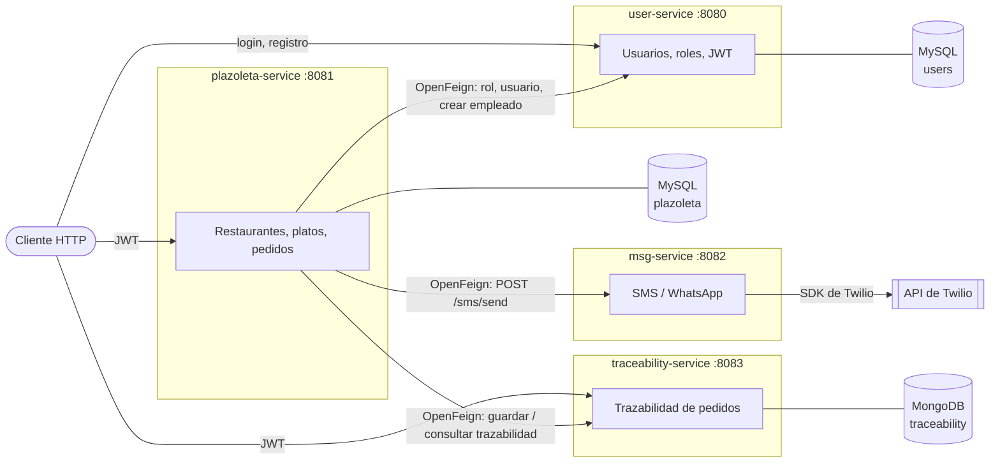

# Reto-Pragma: plazoleta de comidas con microservicios

Repositorio raíz del proyecto Reto Pragma. Agrupa como submódulos de Git los cuatro microservicios de un sistema de plazoleta de comidas: gestión de usuarios y roles, restaurantes, platos y pedidos, notificaciones por SMS/WhatsApp y trazabilidad de los tiempos de cada pedido.

Cada servicio es un proyecto Spring Boot independiente, con su propio repositorio, base de datos y README.

## Tabla de contenidos

- [Estado del proyecto](#estado-del-proyecto)
- [Microservicios](#microservicios)
- [Arquitectura](#arquitectura)
- [Tecnologías](#tecnologías)
- [Cómo clonar](#cómo-clonar)
- [Ejecución en local](#ejecución-en-local)
- [Tests](#tests)
- [Deuda técnica conocida](#deuda-técnica-conocida)
- [Autor](#autor)

## Estado del proyecto

- Es un proyecto de práctica, hecho como parte del Reto Pragma.
- No está desplegado. Está pensado para ejecutarse en local.
- Cada servicio tiene tests unitarios de sus casos de uso con JUnit 5 y Mockito. `plazoleta-service` además tiene un `@WebMvcTest` de las reglas de `SecurityConfig`. No hay tests de integración contra base de datos ni de extremo a extremo.
- No hay Docker Compose ni pipeline de CI.

## Microservicios

| Submódulo (carpeta) | Repositorio | Responsabilidad | Persistencia | Puerto |
|---|---|---|---|---|
| `user-service` | [Jhonmario8/service-user](https://github.com/Jhonmario8/service-user) | Usuarios, roles (ADMIN, OWNER, EMPLOYEE, CLIENT), login y emisión de JWT. | MySQL (`users`) | 8080 |
| `plazoleta-service` | [Jhonmario8/plazoleta-service](https://github.com/Jhonmario8/plazoleta-service) | Restaurantes, categorías, platos y ciclo de vida de los pedidos. | MySQL (`plazoleta`) | 8081 |
| `msg-service` | [Jhonmario8/msg-service](https://github.com/Jhonmario8/msg-service) | Envío de SMS/WhatsApp con el SDK de Twilio. | Ninguna | 8082 |
| `tracebility` | [Jhonmario8/traceability-service](https://github.com/Jhonmario8/traceability-service) | Registro de cambios de estado de los pedidos y tiempo promedio por empleado. | MongoDB (`traceability`) | 8083 |

## Arquitectura

`plazoleta-service` es el único servicio que llama a los demás. Lo hace de forma síncrona por HTTP con OpenFeign y reenvía el header `Authorization` del usuario. Los servicios con seguridad validan el mismo JWT con la clave compartida `PRAGMA_JWT_KEY`.



Todos los servicios, excepto `msg-service`, siguen una arquitectura hexagonal con las capas `domain`, `application` e `infrastructure`. `msg-service` es un paquete plano de cuatro clases.

Flujo principal de un pedido:

1. El cliente crea el pedido (PENDING) y se registra el primer evento de trazabilidad.
2. Un empleado del restaurante se lo asigna (IN_PREPARATION).
3. El empleado lo marca como listo (READY). `plazoleta-service` genera un código de 4 dígitos y `msg-service` se lo envía al cliente por WhatsApp.
4. El empleado lo entrega (DELIVERED) validando ese código. El cliente también puede cancelarlo mientras está PENDING.
5. Cada cambio queda registrado en `traceability-service`, que calcula la duración al cerrar el pedido.

## Tecnologías

- Java 17
- Spring Boot 3.3.5 (`user-service`, `plazoleta-service`, `msg-service`) y Spring Boot 4.0.6 (`traceability-service`)
- Spring Security con JWT (`io.jsonwebtoken` 0.11.5)
- Spring Cloud OpenFeign (solo en `plazoleta-service`)
- MySQL 8, MongoDB
- SDK de Twilio para Java 8.31.1
- MapStruct, Lombok
- Gradle 9.4.1 (wrapper en cada servicio)
- JUnit 5, Mockito, AssertJ

## Cómo clonar

```bash
git clone --recursive https://github.com/Jhonmario8/Reto-Pragma.git
cd Reto-Pragma
```

Si ya lo clonaste sin `--recursive`:

```bash
git submodule update --init --recursive
```

Para traer los últimos cambios de los submódulos:

```bash
git submodule update --remote --merge
```

## Ejecución en local

Requisitos: JDK 17, MySQL 8 en `localhost:3306`, MongoDB en `localhost:27017` y una cuenta de Twilio (sirve trial) para el envío de mensajes.

Variables de entorno:

| Variable | Usada por |
|---|---|
| `PRAGMA_JWT_KEY` | user-service, plazoleta-service, traceability-service. Misma clave en los tres, de al menos 32 caracteres. |
| `MYSQL_USER`, `MYSQL_PASSWORD` | user-service, plazoleta-service |
| `TWILIO_ACCOUNT_SID`, `TWILIO_AUTH_TOKEN`, `TWILIO_FROM_PHONE_NUMBER`, `TWILIO_WHATSAPP_FROM_PHONE_NUMBER` | msg-service |

Orden sugerido, un terminal por servicio:

```bash
cd user-service && ./gradlew bootRun        # :8080
cd msg-service && ./gradlew bootRun         # :8082
cd tracebility && ./gradlew bootRun         # :8083
cd plazoleta-service && ./gradlew bootRun   # :8081
```

Los pasos de base de datos de cada servicio (crear las bases `users` y `plazoleta`, cargar la tabla `roles` y el primer ADMIN) están en su README.

## Tests

En cada servicio:

```bash
./gradlew build
```

Los tests son unitarios: mockean los puertos con Mockito y no levantan el contexto de Spring. La única excepción es `SecurityConfigTest` en plazoleta-service, un `@WebMvcTest` que solo carga la capa web. Ninguno se conecta a MySQL, MongoDB, Twilio ni a otros servicios. El build pasa sin variables de entorno ni bases de datos.

## Deuda técnica conocida

Nombres inconsistentes que se mantienen por ahora para no romper referencias:

- La carpeta del submódulo de trazabilidad se llama `tracebility` (con errata), mientras que el repositorio es `traceability-service`.
- En `traceability-service` el paquete de infraestructura se llama `infrastructura` en lugar de `infrastructure`.
- El repositorio de usuarios se llama `service-user`, pero el submódulo y el proyecto Gradle se llaman `user-service`.
- `user-service` usa el paquete base `com.pragma.plazoleta`, que coincide con el nombre del dominio de `plazoleta-service`.
- En `plazoleta-service` el paquete de entidades JPA se llama `entites`.
- `traceability-service` usa Spring Boot 4 y los demás Spring Boot 3.

En el README de cada servicio hay una sección "Deuda técnica conocida" con los hallazgos de las rondas de tests que siguen pendientes.

## Autor

Proyecto desarrollado por [Jhonmario8](https://github.com/Jhonmario8).
